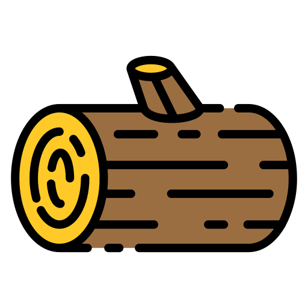

<a id="readme-top"></a>


<!-- PROJECT LOGO -->
<br />
<div align="center">
  <a href="https://github.com/EmperorOwl/LeetLog">
    
  </a>

<h3 align="center">LeetLog</h3>

  <p align="center">
    Track your LeetCode problems and share your solutions
    <br />
    <br />
    <a href="https://app.raylin.dev/leetlog">View Demo</a>
    &middot;
    <a href="https://github.com/EmperorOwl/LeetLog/issues/new?labels=bug&template=bug-report---.md">Report Bug</a>
    &middot;
    <a href="https://github.com/EmperorOwl/LeetLog/issues/new?labels=enhancement&template=feature-request---.md">Request Feature</a>
  </p>
</div>


<!-- TABLE OF CONTENTS -->
<details>
  <summary>Table of Contents</summary>
  <ol>
    <li>
      <a href="#about-the-project">About The Project</a>
      <ul>
        <li><a href="#built-with">Built With</a></li>
      </ul>
    </li>
    <li>
      <a href="#getting-started">Getting Started</a>
      <ul>
        <li><a href="#prerequisites">Prerequisites</a></li>
        <li><a href="#installation">Installation</a></li>
      </ul>
    </li>
    <li><a href="#roadmap">Roadmap</a></li>
    <li><a href="#contributing">Contributing</a></li>
    <li><a href="#license">License</a></li>
    <li><a href="#contact">Contact</a></li>
    <li><a href="#acknowledgments">Acknowledgments</a></li>
  </ol>
</details>


<!-- ABOUT THE PROJECT -->

## About The Project

[![Product Name Screen Shot][product-screenshot]](https://app.raylin.dev/leetlog)

LeetLog is a web application designed to help users track their progress on LeetCode problems
and share their solutions with others. Please note that to track your own problems you must host it yourself.
Feel free to view the [demo](https://app.raylin.dev/leetlog) and see if it's something you'd like to use.

<p align="right">(<a href="#readme-top">back to top</a>)</p>

### Built With

* [![TypeScript][TypeScript]][TypeScript-url]
* [![Express][Express.js]][Express-url]
* [![React][React.js]][React-url]
* [![Material Design][Material-Design]][Material-Design-url]
* [![Docker][Docker]][Docker-url]
* [![Nginx][Nginx]][Nginx-url]

<p align="right">(<a href="#readme-top">back to top</a>)</p>


<!-- GETTING STARTED -->

## Getting Started

### Prerequisites

* npm
  ```sh
  npm install npm@latest -g
  ```

### Installation

1. Clone the repo
   ```sh
   git clone https://github.com/EmperorOwl/LeetLog.git
   ```
   
2. For development, you also want to add a .env variable in the backend folder to link to the database
   ```text
   MONGO_URI=
   ```
   And install the dependencies in both the backend and the frontend
   ```sh
   npm i
   ```

3. Run the relevant docker compose command
   ```sh
   docker compose up backend-dev frontend-dev --build --menu=false
   docker compose up backend-prod frontend-preview --build --menu=false
   docker compose up backend-test --build --menu=false
   ```
   (The real prod requires an SSL certificate and is continuously deployed to an external VM using this 
   [GitHub Actions Workflow](https://github.com/EmperorOwl/LeetLog/blob/master/.github/workflows/cd.yaml))

4. The app should be running on http://localhost:3000/leetlog and the backend on http://localhost:8080

Optional Commands

- Generate a random JWT secret key (suggested for production)
  ```sh
  node -e "console.log(require('crypto').randomBytes(32).toString('hex'))"
  ```

- Generate SSL certificate (required for production)
  ```sh
  sudo apt install certbot python3-certbot-nginx
  sudo certbot --nginx
  ```

- If docker doesn't install new dependencies
  ```sh
  docker compose down -v
  ```

Notes

- The username and password are both admin when in localhost 
  (you can change this in [backend/Dockerfile](https://github.com/EmperorOwl/LeetLog/blob/master/backend/Dockerfile))
- For prod, the password is specified as a GitHub secret; don't choose a password with special characters 
  as bcrypt doesn't handle them well

<p align="right">(<a href="#readme-top">back to top</a>)</p>


<!-- ROADMAP -->

## Roadmap

- [x] List/create/edit/delete problems
- [x] Add authentication; only the admin user has write access
- [x] Search for a problem by name or number
- [x] Filter for problems by list or topic
- [x] Add tips/notes page
- [ ] Stats

See the [open issues](https://github.com/EmperorOwl/LeetLog/issues) for a full list of proposed features (and known
issues).

<p align="right">(<a href="#readme-top">back to top</a>)</p>


<!-- CONTRIBUTING -->

## Contributing

Contributions are what make the open source community such an amazing place to learn, inspire, and create. Any
contributions you make are **greatly appreciated**.

If you have a suggestion that would make this better, please fork the repo and create a pull request. You can also
simply open an issue with the tag "enhancement".
Don't forget to give the project a star! Thanks again!

1. Fork the Project
2. Create your Feature Branch (`git checkout -b feature/AmazingFeature`)
3. Commit your Changes (`git commit -m 'Add some AmazingFeature'`)
4. Push to the Branch (`git push origin feature/AmazingFeature`)
5. Open a Pull Request

<p align="right">(<a href="#readme-top">back to top</a>)</p>


<!-- LICENSE -->

## License

Distributed under the GNU License. See `LICENSE.md` for more information.

<p align="right">(<a href="#readme-top">back to top</a>)</p>


<!-- CONTACT -->

## Contact

Email: `ray@raylin.dev`

Discord: `@emperorowl`

<p align="right">(<a href="#readme-top">back to top</a>)</p>


<!-- ACKNOWLEDGMENTS -->

## Acknowledgments

* [Good Ware](https://www.flaticon.com/free-icon/wood_2933617) for the logo
* [othneildrew](https://github.com/othneildrew) for the readme template
* [Segun](https://dev.to/massivebrains/use-same-dockerfile-for-dev-production-1l7f) for the one Dockerfile for dev and
  prod setup
* [uiwjs](https://github.com/uiwjs/react-md-editor) for the markdown editor

<p align="right">(<a href="#readme-top">back to top</a>)</p>


<!-- MARKDOWN LINKS & IMAGES -->
<!-- https://www.markdownguide.org/basic-syntax/#reference-style-links -->

[product-screenshot]: frontend/public/demo.gif

[TypeScript]: https://img.shields.io/badge/TypeScript-007ACC?style=for-the-badge&logo=typescript&logoColor=white

[TypeScript-url]: https://www.typescriptlang.org/

[Express.js]: https://img.shields.io/badge/Express-000000?style=for-the-badge&logo=express&logoColor=white

[Express-url]: https://expressjs.com/

[React.js]: https://img.shields.io/badge/React-20232A?style=for-the-badge&logo=react&logoColor=61DAFB

[React-url]: https://reactjs.org/

[Material-Design]: https://img.shields.io/badge/Material%20Design-757575?style=for-the-badge&logo=material-design&logoColor=white

[Material-Design-url]: https://material.io/

[Docker]: https://img.shields.io/badge/Docker-2496ED?style=for-the-badge&logo=docker&logoColor=white

[Docker-url]: https://www.docker.com/

[Nginx]: https://img.shields.io/badge/Nginx-009639?style=for-the-badge&logo=nginx&logoColor=white

[Nginx-url]: https://www.nginx.com/
